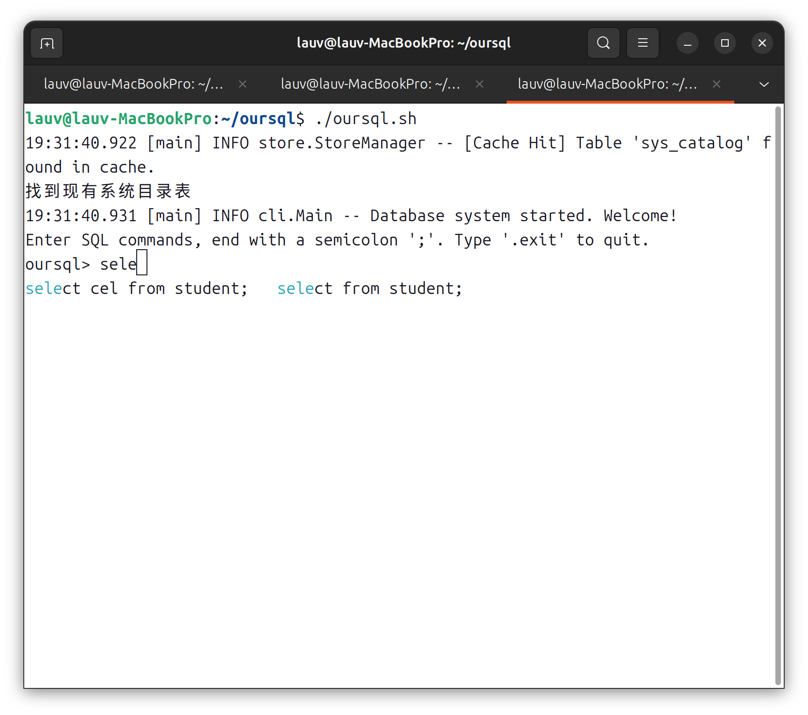
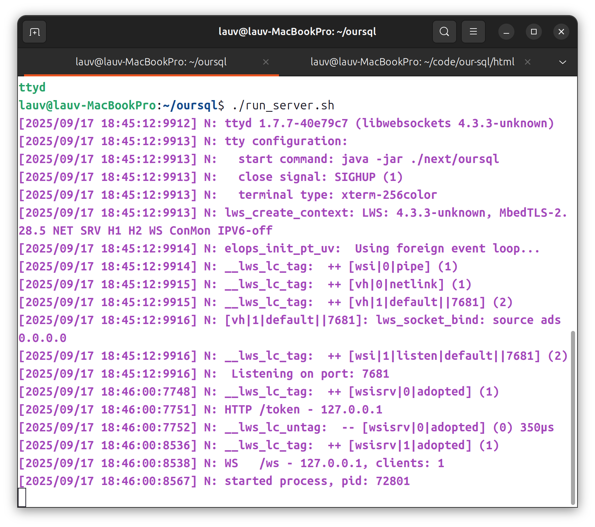
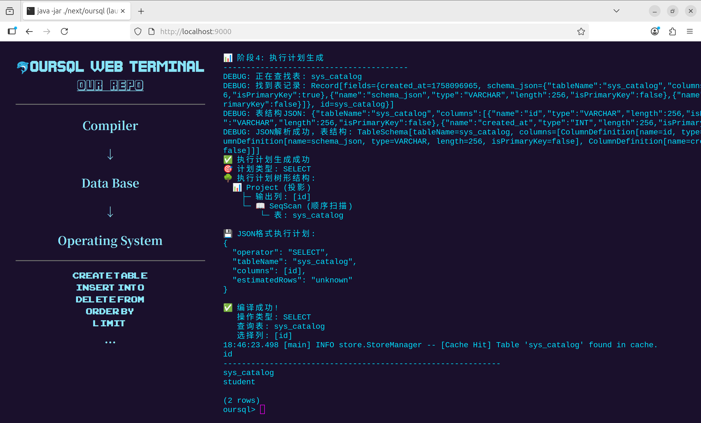
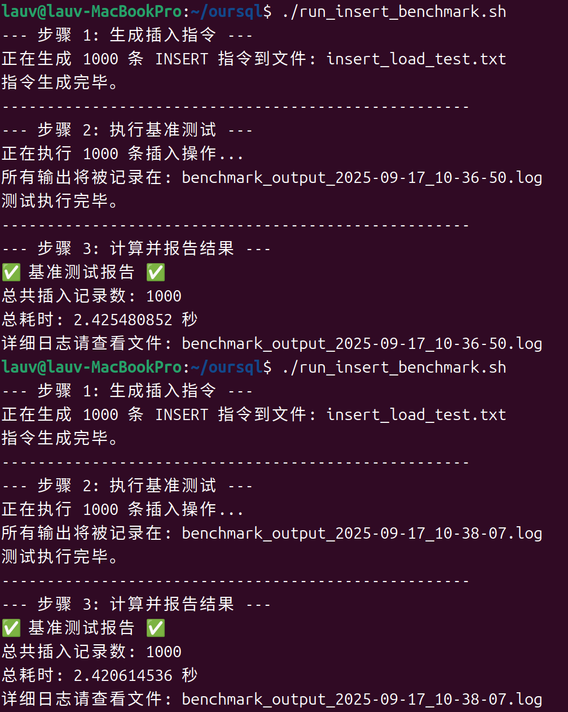

# our-sql


这是一个综合操作系统、编译原理和数据库系统的项目

## 项目结构

```text
our-sql
|--html # 前端网页
|--script # 自动化脚本（用于测试和启动项目）
|--src
    |--main
        |--java
            |--cli # 命令行接口，项目入口
            |--common # 公有方法和配置
            |--executor # SQL执行器
            |--parser # SQL解析
            |--store # 文件存储
```
## 构建与运行

开发环境：Java 21 + Maven 3.9.9

### 构建CLI
```bash
mvn clean package # 构建项目
java -jar ./target/our-sql-1.0-SNAPSHOT.jar # 运行项目
```

接下来你会进入一个以`oursql> `开头的交互式命令行，你可以在里面测试[sql语句](testcase.md)

如果你使用Linux发行版，你可以进入`scripts/`查看启动脚本



### 构建前端工程

```bash
cd html
npm i # 如果你的网络条件不够好，你可以先通过 npm install -g nrm 安装镜像管理器，再通过 nrm 管理镜像，推荐使用tencent或者taobao镜像
npm run start
```

访问 http://localhost:9000 查看网页, 接下来，可以使用[ttyd](https://github.com/tsl0922/ttyd)构建服务端，你可以在参考[`scripts/run.sh`](scripts/run.sh)的启动参数，现在网页端就可以通过websocket与服务端进行通信了

启动服务器





## 分支协作

采用功能特性feature命名法，代码合并通过github的workflow中的pull request实现，保证代码质量审查。如果有合并测试分支，采用test-前缀命名法

- master # 最终代码
- feat-parse # SQL解析分支 maintained by [张辰铭](https://github.com/zhangchenming4017)
- feat-executor # SQL执行器分支 maintained by [刘喜贺](https://github.com/ONeofSu)
- feat-storage # 文件存储分支 maintained by [周攀豪](https://github.com/lauvAri)

## 项目介绍

该项目由三个大模块组成，包括SQL编译器、SQL执行器以及SQL存储器，涉及的专业知识包括：编译原理、数据库系统概念、操作系统原理。

支持的基础SQL语句包括： <code>create table</code>, <code>insert into</code>, <code>select from</code>, <code>delete from</code>；高级SQL语句包括：<code>show tables</code>, <code>update</code>, <code>limit</code>, <code>order by</code>

### 功能测试

通过执行**18**条SQL语句，进行功能测试，自动化测试脚本见`scripts/run_test.sh`，测试结果保存在日志文件中。

这18条测试语句涵盖`create table`, `insert into`, `select from`, `limit`, `order by`, `update`, `delete`等语句，其中既有合法的SQL语句，也有不合法的SQL语句，每个测试用例均给出了预期的输出，详见`testcase.md`

### 性能测试

通过执行**1000**条插入语句，进行性能测试，测试脚本见`scripts/run_insert_benchmark.sh`, 测试结果为插入1000条数据，耗时约为2.4s(这是采用多线程IO优化后的结果，在优化前，我们测试结果为插入1000条数据，耗时约为4.8s)



### 项目支持的特性包括：


#### SQL编译器

- 词法分析器
    - 支持识别SQL关键字(SELECT, FROM, WHERE, CREATE TABLE, INSERT INTO, DELETE，UPDATE, LIMIT等)
    - 支持识别标识符、常量、运算符、分割符
    - 输出token格式 [种别码，词素值，行号，列号]
    - 支持错误提示（非法字符、位置）
- 语法分析器
    - 构建抽象语法树AST
    - 语法错误提示（位置 + 期望符号）
- 语义分析
    - 表/列存在性检测
    - 类型一致性检测
    - 维护系统目录
    - 错误输出格式：[错误类型，位置，原因]
- 执行计划生成器
    - 将AST转为执行计划
    - 支持算子：CREATE TABLE, INSERT, PROJECT, FILTER, SQLSCAN
    - 输出格式：JSON表达式

#### 操作系统页面管理

- 页式存储系统
    - 页大小固定为8KB
    - 支持页的分配、释放、读写
    - 提供读写接口
- 缓存机制
    - 实现页缓存（LRU策略， Least Recently Used）
    - 缓存命中、替换统计
    - 提供读写接口
    - 预读机制
- 接口与集成
    - 通过`src/main/java/store/StoreManager.java`提供统一接口
- 序列化与反序列化
    - 使用`BufferedInputStream`和`BufferedOutPutStream`进行IO缓冲
    - 使用`parallelStream()`进行多线程并行IO
- 持久化数据管理
    - 所有的数据均存储在`~/.oursql/`下
    - 数据文件位于`~/.oursql/data/`下，schema文件位于`~/.oursql/schema`下，索引文件位于`~/.oursql/idx`下
    - 历史命令存储在`~/.oursql_history`文件中

#### 数据库系统

- 执行引擎
    - 支持算子：CREATE TABLE, INSERT, SEQSCAN, FILTER, PROJECT
    - 支持条件查询（WHERE）
- 系统目录
    - 维护系统元数据
    - 目录本身作为一张表存储`sys_catalog`
- 用户接口
    - 支持Web端
    - 支持交互式命令行
    - 命令支持历史记录和TAB补全
- 测试
    - 支持通过shell脚本进行功能测试和性能测试
- 查询优化
    - 谓词下推

