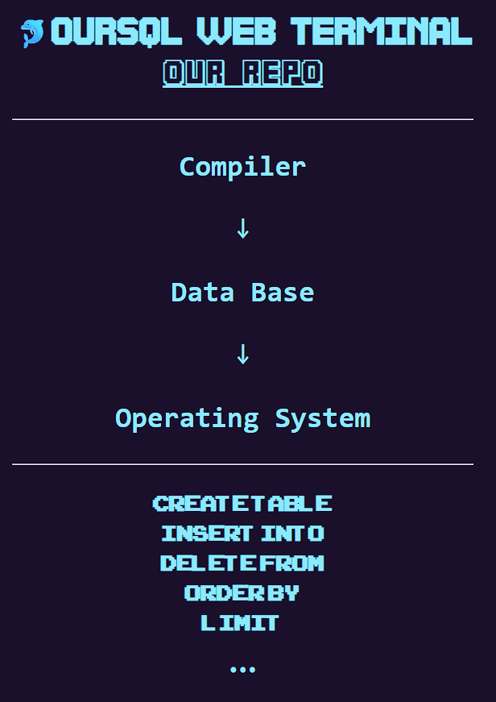

# our-sql



这是一个综合操作系统、编译原理和数据库系统的项目

## 项目结构

```text
our-sql
|--src
    |--main
        |--java
            |--cli # 命令行接口，项目入口
            |--common # 公有方法和配置
            |--executor # SQL执行器
            |--parser # SQL解析
            |--storage # 文件存储
```
## 构建工具

Java 21 + Maven 3.9.9

## 分支协作

- master # 最终代码
- feat-parse # SQL解析分支
- feat-executor # SQL执行器分支
- feat-storage # 文件存储分支